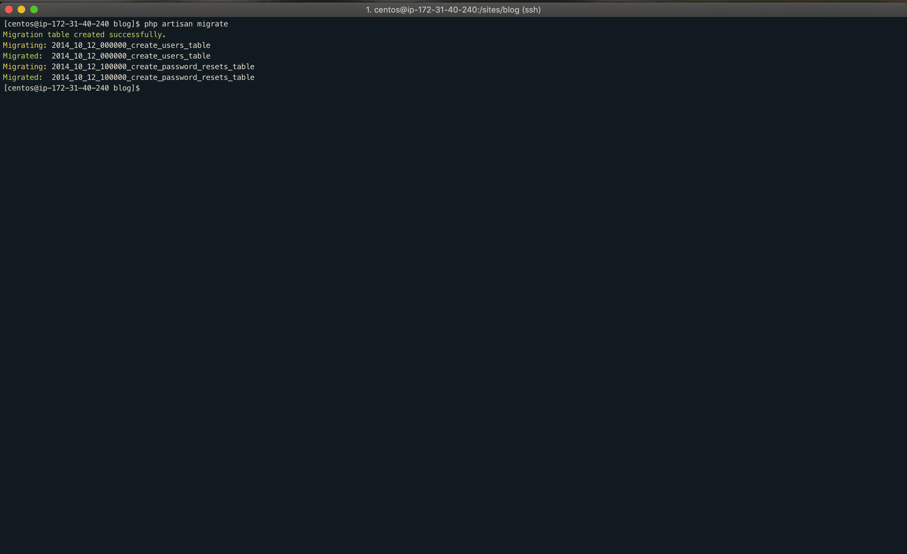

## 0. Đặt vấn đề
Gần đây, các dự án mà tôi có tham gia quản lý tôi nhận thấy một vấn đề đó là không có sự thống nhất giữa cách setting các component được dùng trong hệ thống. Các vấn đề gặp phải thường thấy như là:
* Cài đặt LEMP
* Config server
* Phân quyền và các vấn đề liên quan

Để giải quyết các vấn đề trên chẳng hạn như phân quyền, trước đây tôi thường sử dụng những cách kinh điển và cơ bản kiểu ```chmod 777```. Rõ ràng là cách này không tốt một chút nào cả và lý do tại sao không tốt các bạn hãy tham khảo thêm nhé. 
Trong khuôn khổ bài viết này tôi sẽ hướng dẫn các bạn 
* Cài đặt LEMP trên Centos 7
* Config và cấu hình php để chạy dự án laravel cho phép deploy bằng git

Nào chúng ta hãy bắt đầu.

## 1. Cài đặt git
Do các bản git mới gần đây không còn được cung cấp qua repo của centOS 7 nữa nên chúng ta sẽ tiến hành cài đặt nó từ source code
**a. Cài đặt môi trường compile**
```sh
sudo yum remove git
sudo yum update
sudo yum install -y wget
sudo yum install curl-devel expat-devel gettext-devel openssl-devel zlib-devel 
sudo yum install gcc perl-ExtUtils-MakeMaker
```
**b. Download source code mới nhất của git và cài đặt**
Các bạn hãy vào [link](https://mirrors.edge.kernel.org/pub/software/scm/git/) sau để download source mới nhất của git
Sau khi download source về rồi hãy tiến hành cài đặt như sau
```sh
wget https://mirrors.edge.kernel.org/pub/software/scm/git/git-2.9.5.tar.gz
tar xzf git-2.9.5.tar.gz
cd git-2.9.5
make prefix=/usr/local/git all
make prefix=/usr/local/git install
```
  
Sau đó thêm biến môi trường tại `/etc/environment` với nội dung như dưới
```sh
export PATH=/usr/local/git/bin:$PATH
```
và add nó vào danh sách biến môi trường
```sh
source /etc/environment
```
Kết quả sẽ là


## 2. Cài đặt mysql
Một lần nữa mysql lại không được add sẵn trong repo của CentOS 7 nên chúng ta sẽ cài thủ công. Giả định rằng chúng ta sẽ sử dụng mysql 8x. Trước hết chúng ta truy cập vào [link](https://dev.mysql.com/downloads/repo/yum/) để download package về cho mình

**a. Download rpm package**

```sh
wget https://dev.mysql.com/get/mysql80-community-release-el7-1.noarch.rpm
sudo rpm -ivh mysql80-community-release-el7-1.noarch.rpm
```

**b. Cài đặt và config mysql**

Sau khi add xong mysql như trên, chúng ta tiến hành cài đặt nó.
```sh
sudo yum update
sudo yum install mysql-server
sudo systemctl start mysqld
sudo systemctl enable mysqld
```
Kết quả như dưới


Sau khi cài xong mysql chúng ta cần lấy temporary password mà mysql đã tạo ra cho chính nó để thay mật khẩu cho root
```sh
sudo grep 'temporary password' /var/log/mysqld.log //dMNgqlyYJ7(r
```
Ở bước trên chúng ta đã lấy mật khẩu tạm và lưu ở đâu đó. Tiếp đến chúng ta sẽ set lại mật khẩu cho root
```sh
sudo mysql_secure_installation
```
Làm theo các bước hướng dẫn và set lại password cho root. Kết quả sau khi login lại bằng root ta được như sau:


Bước tiếp theo tao sẽ tạo database và account dùng cho việc phát triển
```sql
mysql>CREATE DATABASE blog;
mysql>CREATE USER 'vnguider'@'localhost' IDENTIFIED WITH mysql_native_password BY 'Vnguider2019@';
mysql>GRANT ALL PRIVILEGES ON blog.* TO 'vnguider'@'localhost';
```
Thoát ra và thực hiện login với account đã tạo ra phía trên để kiểm tra kết quả


Bạn đã thấy nó khác với account root phải không. Đến đây bạn đã cài đặt và tạo xong database cho dự án của mình rồi đấy. 
> Chú ý rằng việc tạo account này rất quan trọng bởi lẻ bạn không nên cấp full quyền access cho account dùng để dev. Ngoài ra ở trên hãy để ý rằng account được tạo ra vs phần host đang là localhost. Để access qua internet thì bạn hãy nghiên cứu thêm nhé.


## 3. Cài đặt nginx
**a. Cài đặt nginx**
Thực hiện cài đặt với các command như dưới
```sh
sudo yum install epel-release
sudo yum update
sudo yum install nginx
```
**b. Thêm nginx như là service**
```sh
sudo systemctl enable nginx
susdo systemctl start nginx
```
Kiểm tra kết quả cài đặt qua chrome


Vậy bản đã cài đặt xong nginx trên CentOS 7. Việc tiếp theo chúng ta sẽ đi cài đặt php

## 4. Cài đặt php
a. Thêm repo
Do trên CentOS 7 không có sẵn repo cho php bản 7.x. Vì vậy chúng ta cần add repo cho nó.
```sh
wget http://rpms.famillecollet.com/enterprise/remi-release-7.rpm
sudo rpm -Uvh remi-release*.rpm
```
Sau khi add xong repo, chúng ta cần enable phiên bản php cần cài. Ở đây tôi sẽ sử dụng php 7.2
```sh
sudo vi /etc/yum.repos.d/remi-php72.repo
```
Hãy chuyển giá trị của trường `enabled` ở đây thành 1


**b. Cài đặt php**
Tiếp đó tiến hành cài đặt php như dưới
```sh
sudo yum update -y
sudo yum install  php-cli php-common php-devel php-fpm php-gd php-mbstring php-mcrypt php-mysqlnd php-pdo php-pear php-pecl-jsonc php-pecl-jsonc-devel php-pecl-zip php-process php-xml php-xmlrpc php-unzip
```
Kết quả sau khi cài php


**c. Thêm php-fpm như là service**
Tiếp theo chúng ta sẽ enable `php-fpm`. Nếu các bạn thắc mắc tại sao lại cần `php-fpm` thì các bạn hãy tìm hiểu qua cơ chế của `nginx`. 
```sh
sudo systemctl enable php-fpm
sudo systemctl start php-fpm
```


**d. Config php.ini**
```sh
sudo vi /etc/php.ini
```
Xét `cgi.fix_pathinfo=0` như bên dưới


**e. Cài đặt composer**
```sh
sudo curl -sS https://getcomposer.org/installer | php
sudo mv composer.phar /usr/local/bin/composer
```
Check composer

## 6. Config laravel
**a. Config nginx**
```sh
sudo vi /etc/nginx/nginx.conf
```
Nội dung như sau
```
# For more information on configuration, see:
#   * Official English Documentation: http://nginx.org/en/docs/
#   * Official Russian Documentation: http://nginx.org/ru/docs/

user nginx;
worker_processes auto;
error_log /var/log/nginx/error.log;
pid /run/nginx.pid;

# Load dynamic modules. See /usr/share/nginx/README.dynamic.
include /usr/share/nginx/modules/*.conf;

events {
    worker_connections 1024;
}

http {
    log_format  main  '$remote_addr - $remote_user [$time_local] "$request" '
                      '$status $body_bytes_sent "$http_referer" '
                      '"$http_user_agent" "$http_x_forwarded_for"';

    access_log  /var/log/nginx/access.log  main;

    sendfile            on;
    tcp_nopush          on;
    tcp_nodelay         on;
    keepalive_timeout   65;
    types_hash_max_size 2048;

    include             /etc/nginx/mime.types;
    default_type        application/octet-stream;

    # Load modular configuration files from the /etc/nginx/conf.d directory.
    # See http://nginx.org/en/docs/ngx_core_module.html#include
    # for more information.
    include /etc/nginx/sites-enabled/*.conf;
}
```
Ở config trên chúng ta thực hiện import các file config từ folder sites-enabled. Trước hết hãy tạo ra nó
```sh
sudo mkdir /etc/nginx/sites-available
sudo mkdir /etc/nginx/sites-enabled
```
Tạo file config trong thư mục sites-available. Giả dụ default.conf. Nội dung như dưới
```
server {
    listen  80;
    server_name 18.179.23.83;
    root /var/www/blog/public/;
    index index.php index.html index.htm;
    location / {
	    try_files $uri $uri?$args $uri/ /index.php?$uri&$args /index.php?$args;
    }

    location ~ ^(.+\.php)(.*)$ {
        try_files $uri /index.php =404;
        fastcgi_pass unix:/var/run/php-fpm/php-fpm.sock;
        fastcgi_index index.php;
	fastcgi_split_path_info ^(.+\.php)(.*)$;
        fastcgi_param  PATH_INFO $fastcgi_path_info;
        fastcgi_buffers 16 16k;
        fastcgi_buffer_size 32k;
        fastcgi_param SCRIPT_FILENAME $document_root$fastcgi_script_name;
        fastcgi_read_timeout 600;
        include fastcgi_params;
    }

    error_page  500 502 503 504  /50x.html;
    location = /50x.html {
        root  /usr/share/nginx/html;
    }
    location /.well-known/acme-challenge/ {
        root /var/www/letsencrypt/;
        log_not_found off;
    }

    error_log /var/log/nginx/blog_error.log;
    access_log /var/log/nginx/blog_access.log;
}
```
Thực hiện link file đã tạo ở trên vào thư mục config của nginx và reload lại nginx
```sh
sudo ln -s /etc/nginx/sites-available/default.conf /etc/nginx/sites-enabled/
sudo nginx -t
sudo systemctl reload nginx
```
**b. Checkout project**
Ở đây tôi sẽ không tập trung để giải thích từng dòng config phía trên nữa. Các bạn có thể đọc thêm hướng dẫn của nginx để hiểu thêm. Tuy nhiên các bạn hãy để ý đến một tham số `fastcgi_pass`. Đây chính là điểm tôi cài đã đề cập khi cài đặt `php-fpm` nói trên.
Tiếp đến tôi sẽ checkout project của tôi từ trên git về. Giả định rằng tôi muốn chứa project của tôi vào thư mục có tên là `/sites`. Đương nhiên để checkout được vào thư mục này nó phải có quyền của user hiện tại. Trong trường hợp của tôi là `centos`. Bạn hãy nhớ lấy điều này vì nó sẽ liên quan mật thiết đến các phần gỡ lỗi tiếp theo.
```sh
sudo mkdir /sites
sudo chown -R centos:centos /sites
cd /sites
git clone git@github.com:sinhhn/myblog.git blog
cd blog
composer install
```
Hãy chú ý rằng, trong config nói trên ta đang trỏ vào thư mục `/var/www/blog`. Chúng ta sẽ thực hiện link nó đến thư mục clone từ git nói trên
```sh
sudo chown -R centos:centos /var/www
ln -s /sites/blog /var/www
```


**c. Chạy migration**
```sh
cd /sites/blog
php artisan migrate
```
Kết quả trông thấy sẽ như dưới


Kiểm tra database xem bảng đã được tạo xong chưa


Như vậy bước đầu ta đã config xong laravel và LEMP trên CentOS 7. Cũng không khó lắm nhỉ.

## 7. Gỡ lỗi
Đầu tiên chúng ta thử truy cập từ chrome xem config trên đã ổn chưa. Thật không may chúng ta nhận kết quả như dưới


Việc trước tiên chúng ta sẽ kiểm tra log để xem nó đang bị lỗi gì.
```
2018/11/07 09:02:28 [error] 12863#0: *5 "/var/www/blog/public/index.php" is forbidden (13: Permission denied), client: 118.238.220.136, server: 18.179.23.83, request: "GET / HTTP/1.1", host: "18.179.23.83"
```

Nghe chừng không có thông tin gì cả. Khoan hãy nhìn lại file `default.conf` nói trên. Sao cgi lại đang được thiết lật như `fastcgi_pass unix:/var/run/php-fpm/php-fpm.sock;` thế này nhỉ. Vậy ta phải sửa config cảu `fastcgi`.
```sh
sudo vi /etc/php-fpm.d/www.conf
```
Tham khảo như dưới


Reload lại config cho fast cgi
```sh
sudo systemctl reload php-fpm
```

Tuy nhiên vẫn chưa cải thiện được tình hình gì cả. Chúng ta nhớ lại lỗi 403 tức là không có quyền trên thư mục tương ứng. Chẳng nhẽ chúng ta sẽ `chmod 777` cho nó. Phân tích lại vấn đề một chút
* thư mục blog đang có chủ sở hữu là centos:centos
* Nếu php chạy trên quyền centos thì chắc sẽ truy cập được

Vậy ta sẽ kiểm tra xem php-fpm đang chạy dưới quyền của user nào
```sh
sudo ps aux | grep php-fpm 
```
Kết quả thật bất ngờ. php-fpm đang chạy với user là apache

Vậy chúng ta sẽ cho nó chạy với quyền centos sẽ giải quyết được vấn đề chăng?
```sh
sudo vi /etc/php-fpm.d/www.conf
```

Sau đó reload lại php-fpm
```sh
sudo systemctl reload php-fpm
```
Có vẻ vẫn bị 403. Nguyên nhân có thể do SElinux trên centos. Chạy lệnh sau để cấp quyền
```sh
sudo chcon -Rv --type=httpd_sys_rw_content_t /sites/blog/
```
Và kết quả sẽ là


## 8. Kết luận
Vậy chúng ta cần chú ý đến những vấn đề sau để cài đặt và config server chính xác
* Quyền chạy php-fpm
* Quyền chạy nginx
* SELinux